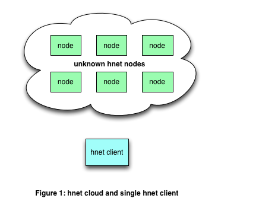
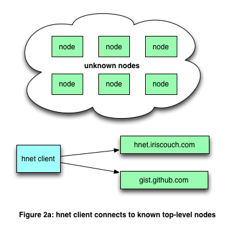
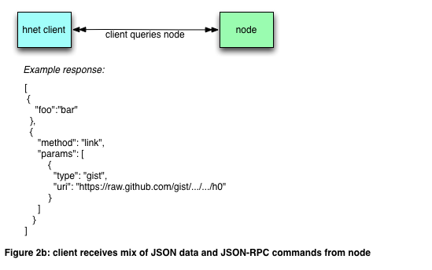
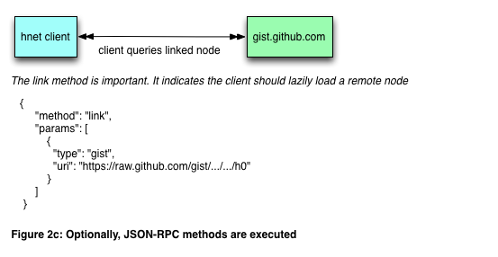
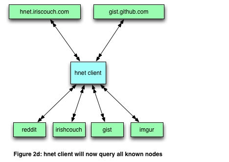
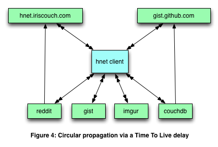
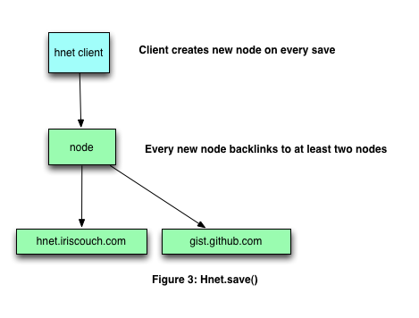

# hnet - an experimental decentralized and anonymous database

## hnet spreads small amounts of data across several non-traditional storage engines such as images, gists, pastebin, twitter streams, irc chat rooms, etc...

## By design, it is not reliable, fast, or consistent. 

### An ideal use-case for hnet would be storing tuples of server IP addresses and ports.

# How does it work?

### A series of unknown hnet nodes exist in the cloud



### You connect to any number of "known" nodes



### These nodes return data and arbitrary JSON-RPC commands



### Optionally, JSON-RPC commands are executed



### Client receives data from many nodes



### Circular node linking is supported through a TTL ( Time To Live )



### Saving data creates a new node that links back to at least two existing nodes



# Usage

For now, you can find many examples of usage here: [hnet api examples](examples/)

[There is also a basic http server example which will response to http requests with `hnet` data](examples/sample-hnet-application/server.js)

## the hnet protocol is JSON

**Supports arbitrary data**

```
[
  { "foo": "bar", "tar": "val" },
  { "foo": "boo", "something": ["a","b","c"] },
  { "foo": "bar", "tar": "val" },
]
```

**Supports JSON-RPC commands**

`hnet` **optionally** supports JSON-RPC commands.

```
[
  { "foo": "boo", "something": ["a","b","c"] },
  { "method": "link", params: [ { "type": "couch", "uri": "http://hnet.iriscouch.com/public/0"} ] },
  { "foo": "bar", "tar": "val" }
]
```

# hnet protocol JSON-RPC methods

### method: link
### params: type, uri

*the link method indicates that we should lazily link this document from a remote dataset*

**type** - the type of dataset we are going to load

*ex: couch, gist, imgur, irc, etc..*

**uri** - the uri of the node. i.e., the location

**ex: http://hnet.iriscouch.com/public/0**

## Ex: 

    { "method": "link", params: [ { "type": "couch", "uri": "http://hnet.iriscouch.com/public/0"} ] },


# TODO:

- Finish pluggable crypto system
- Add additional engines for:
 - Image Steganography
 - PasteBin
 - Reddit
 - Imgur
 - Hacker News deadlink jail
 - Twitter
 - IRC
- Add pluggable item de-duplication engine
